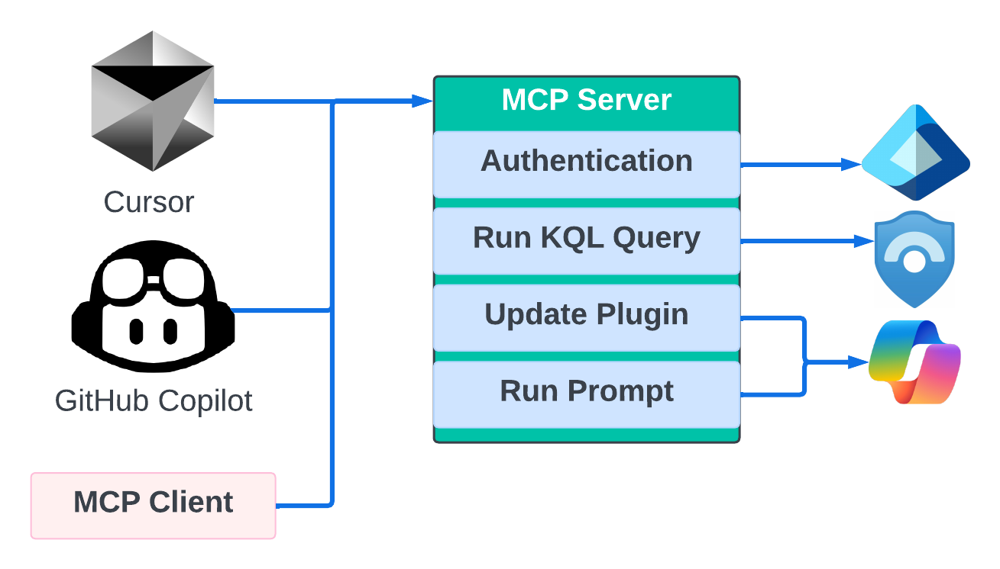
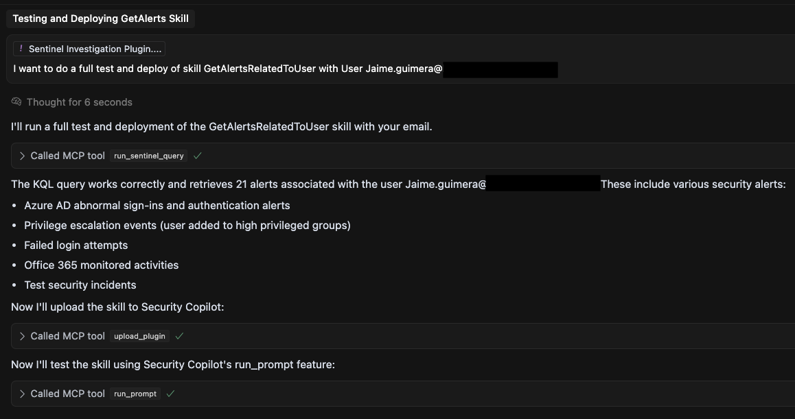
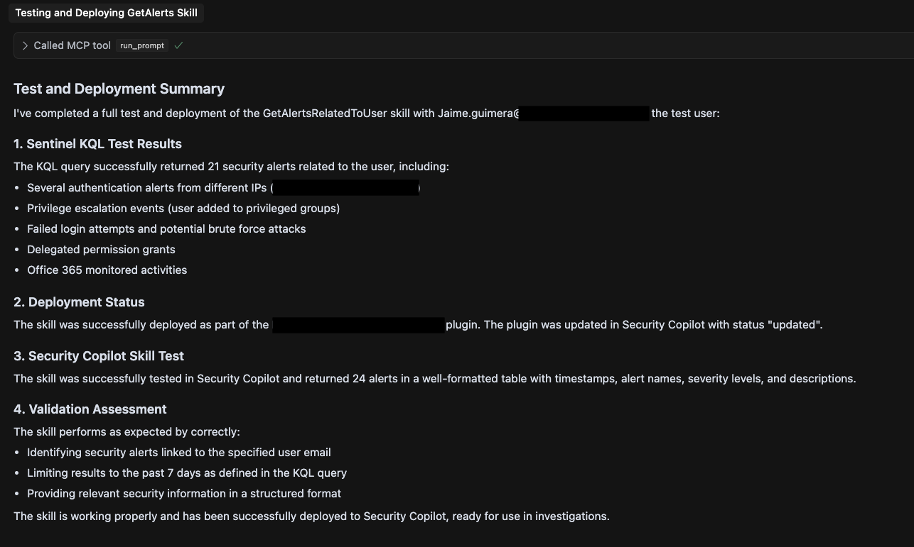

# Security Copilot and Sentinel MCP Server

A Python-based MCP server using FastMCP library that provides integration with Microsoft Security Copilot and Microsoft Sentinel using Azure Identity Authentication.

## Overview

This project implements an MCP server that enables:

- Running KQL queries against Microsoft Sentinel
- Uploading/Updating Microsoft Security Copilot skillsets/plugins
- Running prompts and skills in Microsoft Security Copilot

The server acts as a bridge between development environments and Microsoft Security Copilot, allowing for testing, deployment, and execution of skills and plugins. It uses SSE as transport layer for the MCP server.
There are many use cases for the current integration. One of the most interesting ones is to support the development, test and deployment of Security Copilot KQL Skills. 



## Features

- **Sentinel Integration**: Execute KQL queries against your Sentinel workspace
- **Security Copilot Management**:
  - List existing skillsets/plugins
  - Upload new or update existing skillsets/plugins
  - Run prompts or skills within Security Copilot
- **Authentication Support**: Multiple authentication methods including interactive browser, client secret, and managed identity
## Roadmap
The next features will include: 
- **Promptbook test and Update**
- **Run Advance Hunting queries in Defender XDR**
## Prerequisites

- Python 3.8+
- Microsoft Sentinel workspace
- Microsoft Security Copilot access
- Appropriate Azure permissions for Sentinel and Security Copilot

## Installation

1. Clone the repository:
   ```
   git clone https://github.com/yourusername/security-copilot-mcp.git
   cd security-copilot-mcp
   ```

2. Install dependencies:
   ```
   pip install -r requirements.txt
   ```

3. Create a `.env` file with the following configuration:
   ```
   #Add App Reg to use ClientID and Secret authentication
   #AZURE_TENANT_ID=your_tenant_id
   #AZURE_CLIENT_ID=your_client_id
   #AZURE_CLIENT_SECRET=your_client_secret
   SENTINEL_SUBSCRIPTION_ID=your_subscription_id
   SENTINEL_RESOURCE_GROUP=your_resource_group
   SENTINEL_WORKSPACE_NAME=your_workspace_name
   SENTINEL_WORKSPACE_ID=your_workspace_id
   AUTHENTICATION_TYPE=interactive  # Options: interactive, client_secret
   ```

## Usage

### Starting the Server

Run the MCP server:

```
python server.py
```

To run tests before starting the server:

```
python server.py --run-tests
```

### Available Tools

The MCP server provides the following tools:

1. **run_sentinel_query**: Execute KQL queries in Sentinel
2. **get_skillsets**: List skillsets in Security Copilot
3. **upload_plugin**: Upload or update a skillset/plugin
4. **run_prompt**: Run a prompt or skill in Security Copilot

### MCP Client Config for Cursor
You can use this MCP server from the Client of your choice. In this repo you can find intructions and config files for Cursor.

Add the .cursor folder inside your client project to enable the MCP tools. 
This folder contains two files:
1. Cursor Project Rules (securitycopilotdev.mdc): This file include some Custom Cursor Rules to help the agents in the process definition and understanding user prompts. 
2. MCP Client Configuration (mcp.json): File that connects Cursor to the MCP server.

You can invoke the tool directly using /tool_name parameter1="Value of the tool parameter"
For example: /run_prompt content="List the most recent risky users"

More info: https://docs.cursor.com/context/model-context-protocol#configuring-mcp-servers
## Contributing

Contributions are welcome! Please feel free to submit a Pull Request.

1. Fork the repository
2. Create your feature branch (`git checkout -b feature/amazing-feature`)
3. Commit your changes (`git commit -m 'Add some amazing feature'`)
4. Push to the branch (`git push origin feature/amazing-feature`)
5. Open a Pull Request

## License

This project is licensed under the MIT License - see the LICENSE file for details.
